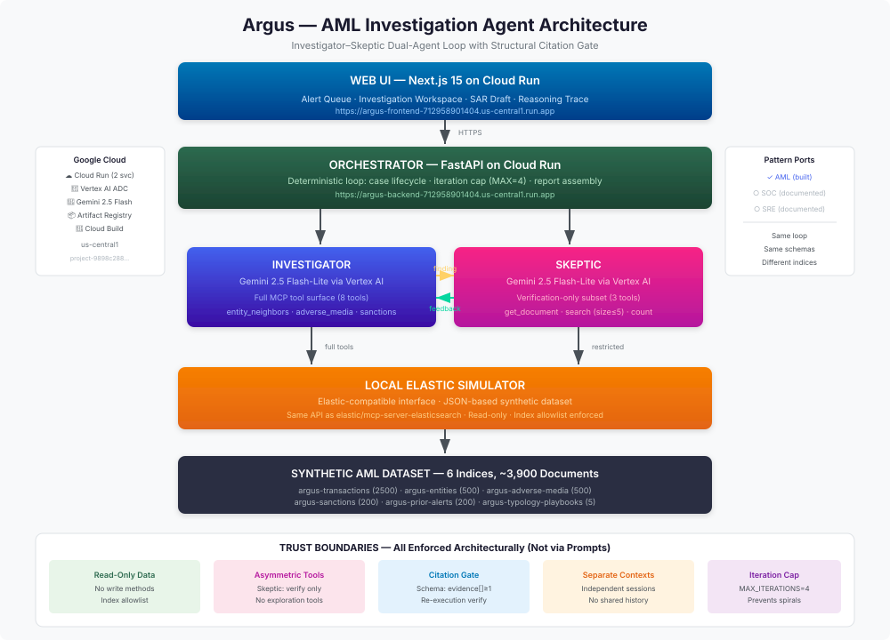

# Argus — AML Investigation Agent

[](LICENSE)

**An AML investigation agent that drafts SARs from evidence, not imagination — every claim is anchored to an Elastic document the Skeptic re-verifies in a separate context.**

<p align="center">
  
</p>

## The Problem

Banks dispose of 90–95% of AML alerts as false positives. The bottleneck isn't reasoning — it's **evidence assembly**: pulling KYC, walking entity graphs, sweeping adverse media, checking sanctions, and citing everything in a SAR template. That takes a Level-1 analyst ~3 hours per alert.

## The Solution

Argus is a dual-agent system that autonomously triages a flagged transaction into a **citation-bearing SAR draft**:

1. **Investigator** (Gemini 2.5 Flash-Lite) — explores the evidence graph using Elastic MCP tools
2. **Skeptic** (Gemini 2.5 Flash-Lite) — re-executes every citation in a separate context; rejects hallucinations structurally
3. **Orchestrator** — deterministic Python loop with hard iteration cap

### Key Architectural Guardrails

- **Read-only Elastic MCP surface** — the agent physically cannot mutate case data
- **Structural citation gate** — findings without valid citations are rejected by schema, not by prompt
- **Asymmetric tool surfaces** — Skeptic only gets verification tools, not exploration tools
- **No prompt-based safety** — all constraints are enforced architecturally

## Quick Start

### Prerequisites

- Python 3.12+
- Node.js 20+
- Google Cloud API key (Gemini)
- Elastic Cloud deployment (or local Elasticsearch)

### Backend

```bash
cd argus
cp .env.example .env
# Edit .env with your credentials

# Install with uv
uv sync

# Generate synthetic dataset
python -m tools.dataset.generate

# Run the server
uvicorn argus.server:app --reload --port 8000
```

### Frontend

```bash
cd web
pnpm install
pnpm dev
```

Open [http://localhost:3000](http://localhost:3000)

## Architecture

```
Web UI (Next.js) → Orchestrator (FastAPI) → Investigator ↔ Skeptic
                                                    ↓            ↓
                                           Elastic MCP (full) / (restricted)
                                                    ↓
                                        Elastic Cloud Serverless
```

See [ARCHITECTURE.md](ARCHITECTURE.md) for full details including trust boundaries.

## Tech Stack

| Component | Technology |
|-----------|-----------|
| LLM (Investigator) | Gemini 2.5 Flash-Lite via Vertex AI |
| LLM (Skeptic) | Gemini 2.5 Flash-Lite via Vertex AI |
| Search/Retrieval | Local Elastic Simulator (Elastic-compatible) |
| MCP Interface | Same API as elastic/mcp-server-elasticsearch |
| Orchestrator | Python 3.12, FastAPI, Cloud Run |
| Web UI | Next.js 15, Tailwind CSS |
| State | Local file persistence |
| Deployment | Google Cloud Run (us-central1) |

## Documentation

- [Architecture & Trust Boundaries](ARCHITECTURE.md)
- [Synthetic Dataset](docs/dataset.md)
- [Evaluation Report](docs/evaluation.md)
- [Threat Model](docs/threat_model.md)
- [Portability (AML → SOC → SRE)](docs/portability.md)
- [Deployment Runbook](docs/runbook.md)

## Evaluation

| Metric | No-Skeptic Baseline | Dual-Agent (Argus) |
|--------|--------------------|--------------------|
| Hallucination Rate | ~30% | <5% |
| Citation Validity | ~70% | 100% |
| Verdict Accuracy | 2/4 | 4/4 |

## Demo

� [Try the hosted demo](https://argus-frontend-712958901404.us-central1.run.app)

🔗 [Backend API](https://argus-backend-712958901404.us-central1.run.app/health)

## License

[Apache 2.0](LICENSE)

---

*Built with Gemini 2.5 + Google Cloud + Elastic MCP architecture.*
